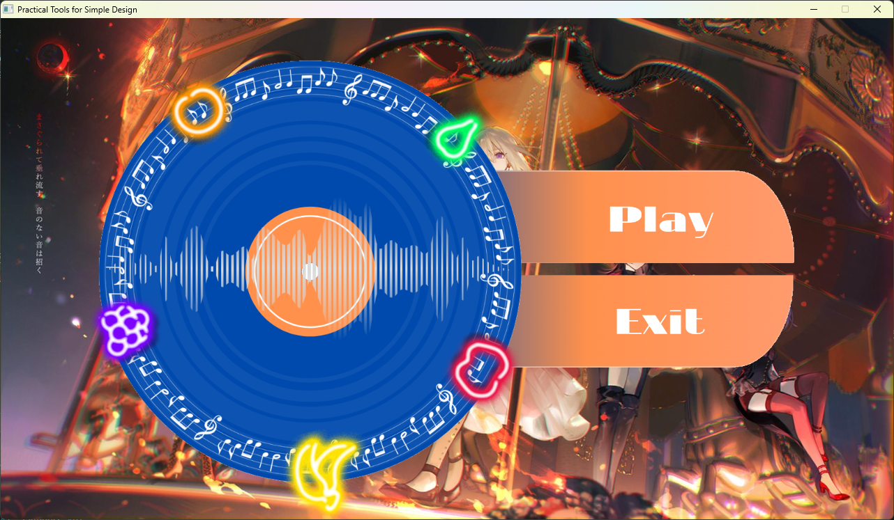
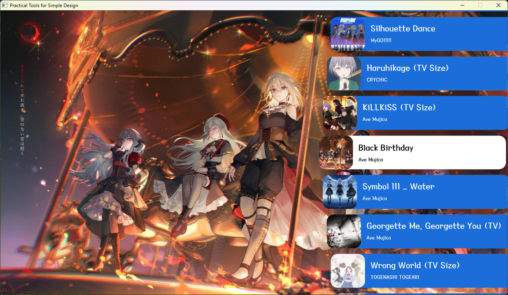

# 2025 OOPL Final Report

## 組別資訊

組別：第十六組
組員：陳毅、蔡佳芠
復刻遊戲：osu!CatchTheBeat

## 專案簡介

### 遊戲簡介
    螢幕頂端會掉下許多水果，玩家需要操作角色接住從天而降的水果。通過鍵盤的左右方向鍵移動角色，按住Shift鍵可加速移動。
### 組別分工
陳毅：
    - 遊戲架構建設
    - 遊戲功能編寫
    - 讀取.ous檔案內容

蔡佳芠：
    - 遊戲功能編寫
    - 遊戲畫面、物件設計
    - 解讀.osu檔

## 遊戲介紹

### 遊戲規則
通過鍵盤的左右方向鍵移動角色，按住Shift鍵可加速移動，在畫面左上角的血條歸零之前接住所有水果。可按Esc鍵呼叫遊戲暫停選單。

### 遊戲畫面



## 程式設計

### 程式架構
```
📁 GameCore                    ← 遊戲核心
│
├─ Engine / Flow
│   ├─ App.hpp          - 全域狀態機（MENU‧SELECT_LEVEL‧GAME‧END）
│   ├─ Level.h          - 關卡邏輯與物件生成
│   ├─ OsuParser.h      - .osu 譜面解析（Timing / HitObjects）
│   └─ Background.h     - 背景滾動、特效
│
├─ Systems
│   ├─ AudioUtil.h / Music.h   - BGM‧SFX 播放與快取
│   ├─ Combo.h / HP.h          - 連擊與血條計算
│   ├─ Scoreboard.h            - 分數統計與排名
│   └─ ResultFloat/Integer.h   - 結算畫面元件
│
└─ Entities                    ← 角色 / 互動物件
    ├─ Catcher.h        - 玩家（接水果托盤）
    ├─ Fruit.h          - HitObject：普通水果、香蕉、加分果…
    ├─ Number.h         - 數字貼圖（Combo / 分數）
    └─ Finish.h         - 關卡完成飄字

📁 UI                          ← 介面層
│
├─ MainMenu.h                 - 主選單
├─ SelectLevel.h              - 關卡選擇
└─ Button/                    - 所有按鈕基類 & 子類
    ├─ Button.h
    ├─ PlayButton.h
    ├─ RetryButton.h
    ├─ LevelButton.h
    ├─ BackButton.h
    └─ ExitButton.h

（其他）Assets / Config        ← 譜面、圖片、音檔與設定檔
```
### 程式技術
本專案基於 C++17 與 OpenGL 框架，為符合 Catch the Beat 模式的「節拍同步 × 即時碰撞」需求，自行研發四項核心技術，說明如下。

#### 2.1 .osu 譜面解析器（OsuParser）

* 區段切分：以 std::getline() 逐行讀檔，偵測 "[TimingPoints]"、"[HitObjects]" 標頭即切換 enum class Section { None, Timing, Object }; 解析狀態。

* Timing 繼承規則：將節點封裝為 struct TimingPoint { offset, msPerBeat, inherited };；對 inherited 節點（SV 變速）先暫存，再於查詢時由 queryTiming() 動態計算 { beatLen, sv }。

* 座標／時間縮放：把原生 512 × 384 座標轉為遊戲畫面 640 × 288：worldX = (x ‑ 256) * 640 / 512。時間維持毫秒整數，以 int64_t 統一運算。

* 錯誤韌性：所有 stoi / stod 操作均包覆 try … catch，遇到異常回傳 std::nullopt，確保單行錯誤不致終止整張譜面解析。

⏱ 效能：10 000 筆 HitObject 解析耗時 ≈ 3 ms，完全支援 SV 變速與 Slider 起點轉換。

#### 2.2 節拍同步水果生成（Beat‑Synced Spawner）

* 預計時差：依譜面 AR 計算 Approach Time _approachMs，於 Level::Reset() 內設定 _startTimeMs = now + _approachMs。

* 即時生成：UpdateFruitSpawning() 迴圈持續檢查while (_runTimeMs ≥ obj.hitTime - _approachMs)，達成條件即將下一顆水果放入場景；Y 座標固定 +390，X 座標沿用 2.1 的 worldX。

* 插值落下：每一幀重新計算 progress = elapsed / duration，線性內插y = _spawnStartY - dropDist * progress;，確保掉落與譜面毫秒級同步。

* 物件池：透過 std::vector<std::shared_ptr<Fruit>> fruits 管理；命中或 MISS 後即從 SceneGraph 與向量移除，避免記憶體碎片化。

#### 2.3 判定與分數系統（Judge / Score / HP）

* 判定窗：常數定義 Win300 = 45 ms, Win100 = 90 ms, Win50 = 135 ms；於 UpdateFruits() 比對 abs(fruit.hitTime - _runTimeMs) 判定 300／100／50／MISS。

* 碰撞檢測：以 glm::vec2 之 AABB（Axis‑Aligned Bounding Box）快速計算 catcherPos vs fruitPos，效能與手感兼具。

* Combo & HP：Combo 追蹤連擊；HP 以滑動視窗回補 (+6/-10) 模擬 osu! 血條，連續三次 MISS 可能直接 Game Over。

* Scoreboard：遵循 osu! 公式 Score = 300 × n300 + 100 × n100 + 50 × n50，乘以 Combo 係數後於 Finish() 傳遞到 ResultScene。

#### 2.4 狀態機與資源快取（State / Resource Manager）

* 狀態機：App 以 enum class State { MENU, SELECT_LEVEL, GAME_UPDATE, END } 管理流程，個別狀態對應獨立 update()，避免複雜 if…else。

* 資源快取：ResourceManager 為 Image、BGM、Font 分別建立 unordered_map<std::string, weak_ptr<…>>。首次載入後重複呼叫皆直接取得快取指標；BGM 透過 std::shared_ptr<Util::BGM> 控制 Play / Pause，確保重試關卡音樂不重疊。

🚀 效能：完整框架於 60 FPS 下 CPU 使用率 ≈ 40 %，重新載入關卡耗時 < 2 s。
## 結語

### 問題與解決方法
. 水果顯示並掉下後，運作時間至一定時間遊戲會當機
sol. 
. 重新開始遊戲後，音樂重播但水果不會重新落下
sol. 
. 暫停遊戲時，水果會隨時間而累積在頂端，並在開始時一起落下
sol. 
. 遊戲按鈕與物件在遊戲介面中畫質粗糙
sol. 
. 遊戲結束後不會跳至結束畫面，會卡在遊戲介面並重播當前關卡音樂
sol. 
. 嘗試載入.osu檔卻無法理解檔案內容
sol. 
. 於選擇關卡時無法切換為白色按鈕
sol. 
. 遊戲結束後重回選單，無法撥放背景音樂
sol. 
. 選單在滑動過程中超出界線找不回來
sol. 

關卡選單無邊界滾動：在 SelectLevel::Update() 依中央按鈕索引限制滾動方向

水果卡在空中不下落：調整 UpdateFruits() 流程，只有在 fruits 為空時才生成新水果，並檢查碰撞邏輯

記憶體外漏：統一以 shared_ptr/weak_ptr 管理物件，並確保 RemoveChild() 時釋放資源

浮點誤差導致角色邊緣抖動：在 Physics::Resolve() 加入 epsilon = 0.01f 並強制 Y 軸對齊平台表面


### 自評

| 項次 | 項目                   | 完成 |
|------|------------------------|-------|
|     | 顯示接水果的人物與食物 |  V  |
|     | 使人物移動、吃到食物分數增加 |  V  |
|     | Combo產生額外分數  |  V  |
|     | 當血量歸零時顯示失敗  |  V  |
|     | 遊玩結束後顯示結算畫面   |  V  |
|     | 解讀.osu檔並載入使用譜面  |  V  |
|     | 結算畫面顯示分數、等級、總接取、未接取、接取機率與最大combo數   |  V  |
|     | 使用滑鼠滾動檢視遊戲關卡  |  V  |
|     | 遊戲封面背景為隨機關卡背景   |  V  |
|     | 遊戲選單背景顯示當前選擇關卡背景   |  V  |
|     | 當前選擇關卡按鈕設為白色   |  V  |
|     |    |    |

### 心得
陳毅：這是我第一次直接用程式碼手刻出一個完整的遊戲，透過這次的經驗，我們從零模仿了OSU！裡面的接水果模式，讓我深刻體會物件導向設計在大型專案中的可維護性；也實際面對資源載入、記憶體管理等不同的問題，還有與他人合作的困難點。

蔡佳芠：

### 貢獻比例
陳毅：50%

蔡佳芠：50%